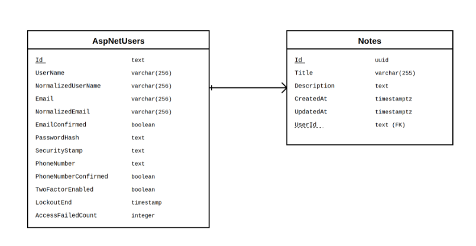
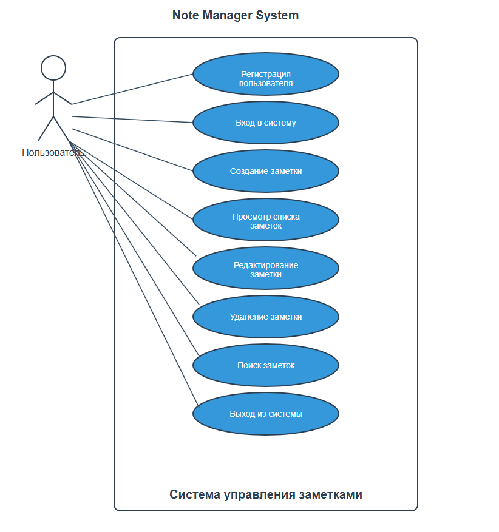
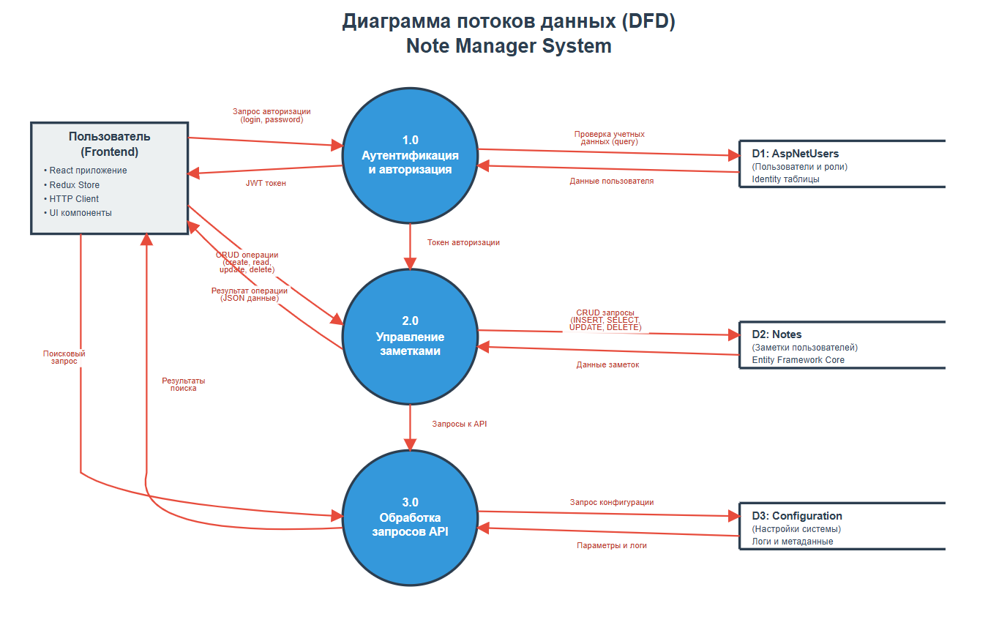
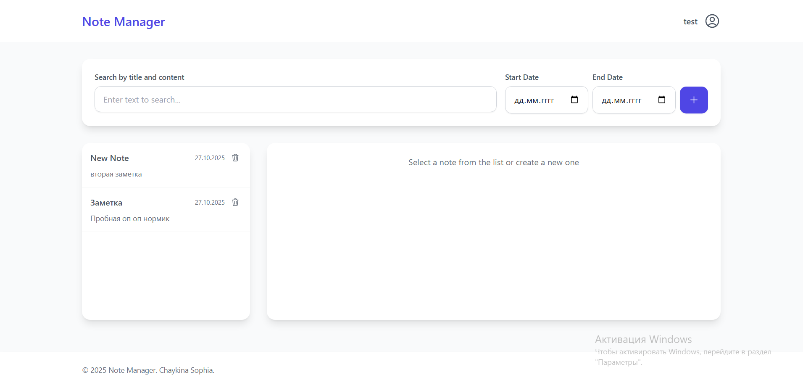
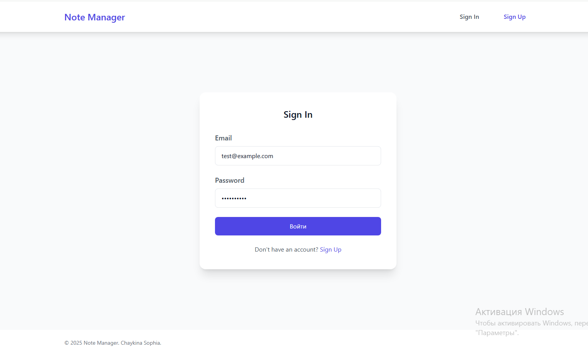

# Note Manager - Web-приложение для управления заметками

## Содержание
1. [Актуальность проекта](#1-актуальность-проекта)
2. [Архитектура приложения](#2-архитектура-приложения)
3. [Детальное описание приложения](#3-детальное-описание-приложения)
4. [Описание интерфейса программы](#4-описание-интерфейса-программы)
5. [Развертывание](#5-развертывание)
6. [Потенциальное будущее развитие](#6-потенциальное-будущее-развитие)
7. [Список источников](#7-список-источников)

## 1. Актуальность проекта

### Цель проекта
Разработка современного веб-приложения для персонального управления заметками с возможностью безопасного хранения и организации текстовой информации.

### Проблематика
В современном мире пользователи сталкиваются с необходимостью быстро записывать и структурировать информацию. Существующие решения часто требуют установки дополнительного ПО или имеют ограниченный функционал. Отсутствие централизованного веб-решения с персональной аутентификацией создает потребность в разработке специализированного приложения.

### Целевая аудитория
- Студенты и преподаватели для ведения учебных записей
- Офисные работники для организации рабочих заметок  
- Частные пользователи для персональных записей
- Исследователи и аналитики для структурирования информации

### Решаемые задачи
- Централизованное хранение заметок с веб-доступом
- Персонализация данных через систему аутентификации
- Кроссплатформенная доступность через браузер
- Простота использования и интуитивный интерфейс

## 2. Архитектура приложения

### Технологический стек

**Backend:** ASP.NET Core 8.0, Entity Framework Core, PostgreSQL/SQL Server, JWT Authentication, AutoMapper, Swagger/OpenAPI

**Frontend:** React 18, TypeScript, Redux Toolkit, React Router, Tailwind CSS, Axios, Vite

**Развертывание:** Docker, Render, GitHub

### Архитектурный подход
Приложение построено по принципам Clean Architecture с разделением на слои: контроллеры, сервисы, репозитории и сущности. Frontend реализован как SPA с компонентной архитектурой React.

## 3. Детальное описание приложения

### Структура базы данных

**ERD диаграмма:**



**Схема таблиц:**

```sql
-- Пользователи (ASP.NET Identity)
AspNetUsers (
    Id: text (PK),
    UserName: character varying(256),
    NormalizedUserName: character varying(256),
    Email: character varying(256),
    NormalizedEmail: character varying(256),
    EmailConfirmed: boolean,
    PasswordHash: text,
    SecurityStamp: text,
    PhoneNumber: text,
    PhoneNumberConfirmed: boolean,
    TwoFactorEnabled: boolean,
    LockoutEnd: timestamp,
    AccessFailedCount: integer
)

-- Заметки
Notes (
    Id: uuid (PK),
    Title: character varying(255),
    Description: text,
    CreatedAt: timestamp with time zone,
    UpdatedAt: timestamp with time zone,
    UserId: text (FK -> AspNetUsers.Id)
)
```

**Связи:**
- AspNetUsers → Notes (1:N) - один пользователь может иметь множество заметок
- Notes.UserId → AspNetUsers.Id (FK) - внешний ключ для связи с пользователем
- Каскадное удаление: при удалении пользователя удаляются все его заметки

### Архитектурные паттерны

#### Backend (Clean Architecture)
```
Controllers/          # API контроллеры
├── AuthController    # Аутентификация
└── NotesController   # CRUD операции с заметками

Services/             # Бизнес-логика
├── INoteService      # Интерфейс сервиса заметок
└── NoteService       # Реализация бизнес-логики

Repositories/         # Доступ к данным
├── INoteRepository   # Интерфейс репозитория
└── NoteRepository    # Реализация работы с БД

DTOs/                 # Объекты передачи данных
├── Auth/             # DTO для аутентификации
└── Notes/            # DTO для заметок

Entities/             # Сущности базы данных
└── Note              # Модель заметки
```

#### Frontend (Feature-based)
```
src/
├── components/       # Переиспользуемые компоненты
│   ├── auth/         # Компоненты аутентификации
│   └── layout/       # Компоненты макета
├── pages/            # Страницы приложения
├── store/            # Redux store и слайсы
├── services/         # API сервисы
└── utils/            # Утилиты
```

### Use Case диаграммы



**Актеры:** Пользователь, Система

**Use Cases:**
- Регистрация пользователя
- Вход в систему
- Создание заметки
- Просмотр списка заметок
- Редактирование заметки
- Удаление заметки
- Поиск заметок
- Выход из системы

### Диаграмма потоков данных



**Поток данных:**
```
Frontend (React) 
    ↓ HTTP/JSON
Backend API (ASP.NET Core)
    ↓ Entity Framework
Database (PostgreSQL)
```

## 4. Описание интерфейса программы

### Главная страница


Главная страница содержит:
- Заголовок приложения
- Навигационное меню
- Список заметок пользователя
- Кнопку создания новой заметки

### Страница регистрации


Форма регистрации включает:
- Поле для email
- Поле для имени пользователя
- Поле для пароля
- Кнопку регистрации
- Ссылку на страницу входа

### Страница входа


Форма входа содержит:
- Поле для email
- Поле для пароля
- Кнопку входа
- Ссылку на страницу регистрации

### Страница создания/редактирования заметки


Форма заметки включает:
- Поле для заголовка
- Текстовое поле для описания
- Кнопки сохранения и отмены

### Мобильная версия


Адаптивный дизайн обеспечивает:
- Корректное отображение на мобильных устройствах
- Удобную навигацию на сенсорных экранах
- Оптимизированные размеры элементов интерфейса

## 5. Развертывание

### Инфраструктура развертывания

**Платформа:** Render (облачный хостинг)
- **Backend API**: https://notebookapp-bpew.onrender.com
- **Frontend**: https://notemanager-frontend.onrender.com  
- **Database**: PostgreSQL (управляемая Render)

**🔗 Демо приложения:** [https://notemanager-frontend.onrender.com](https://notemanager-frontend.onrender.com)

### Архитектура развертывания

**Backend сервис:**
- Контейнеризация с помощью Docker
- Автоматическое применение миграций Entity Framework при запуске
- Поддержка переменных окружения для конфигурации
- SSL/TLS терминация на уровне балансировщика Render
- Автоматический перезапуск при обновлении кода в Git

**Frontend сервис:**
- Статический хостинг собранного React приложения
- Автоматическая сборка через Vite при деплое
- CDN для быстрой доставки статических ресурсов
- Настройка SPA routing через redirects/rewrites

**База данных:**
- Управляемый PostgreSQL инстанс на Render
- Автоматические бэкапы и мониторинг
- SSL подключения для безопасности
- Поддержка connection pooling

### Конфигурация безопасности

**CORS политики:**
- Настройка разрешенных origins для API запросов
- Поддержка preflight запросов для сложных HTTP методов
- Ограничение доступа только к авторизованным доменам

**JWT аутентификация:**
- Секретный ключ хранится в переменных окружения
- Настройка времени жизни токенов
- Валидация issuer и audience

**Переменные окружения:**
```
ASPNETCORE_ENVIRONMENT=Production
ConnectionStrings__DefaultConnection=<PostgreSQL URL>
Jwt__Key=<Secret Key>
Jwt__Issuer=NoteManagerApi
Jwt__Audience=NoteManagerClient
CORS__AllowedOrigins__0=<Frontend URL>
```

### Процесс развертывания

1. **Подготовка кода:** Коммит изменений в GitHub репозиторий
2. **Автоматический деплой:** Render отслеживает изменения в main ветке
3. **Сборка backend:** Docker контейнер собирается согласно Dockerfile
4. **Сборка frontend:** Vite выполняет production сборку React приложения
5. **Применение миграций:** EF Core автоматически обновляет схему БД
6. **Запуск сервисов:** Backend и frontend становятся доступными по URL

### Мониторинг и логирование

- Встроенные логи Render для отслеживания работы приложения
- Мониторинг производительности и доступности сервисов
- Автоматические уведомления о сбоях в работе
- Метрики использования ресурсов (CPU, память, сеть)

## 6. Потенциальное будущее развитие

### Функциональные улучшения
- **Категории и теги** - система организации заметок по категориям и тегам
- **Расширенный поиск** - полнотекстовый поиск с фильтрацией
- **Markdown поддержка** - форматирование текста с предварительным просмотром
- **Совместное использование** - возможность делиться заметками с другими пользователями
- **Экспорт данных** - экспорт в PDF, Word, текстовые форматы

### Технические улучшения
- **Кэширование** - Redis для повышения производительности
- **Микросервисная архитектура** - разделение функционала на независимые сервисы
- **Мобильное приложение** - нативные клиенты для iOS и Android
- **Офлайн режим** - локальное хранение с синхронизацией
- **CI/CD пайплайн** - автоматизация тестирования и развертывания

## 7. Список источников

### Документация и официальные ресурсы
1. [ASP.NET Core Documentation](https://docs.microsoft.com/en-us/aspnet/core/) - официальная документация ASP.NET Core
2. [Entity Framework Core Documentation](https://docs.microsoft.com/en-us/ef/core/) - документация по EF Core
3. [React Documentation](https://react.dev/) - официальная документация React
4. [TypeScript Handbook](https://www.typescriptlang.org/docs/) - руководство по TypeScript
5. [Redux Toolkit Documentation](https://redux-toolkit.js.org/) - документация Redux Toolkit

### Технические ресурсы
6. [JWT.io](https://jwt.io/) - информация о JSON Web Tokens
7. [Tailwind CSS Documentation](https://tailwindcss.com/docs) - документация по Tailwind CSS
8. [PostgreSQL Documentation](https://www.postgresql.org/docs/) - документация PostgreSQL
9. [Docker Documentation](https://docs.docker.com/) - документация Docker
10. [Render Documentation](https://render.com/docs) - документация платформы Render

### Обучающие материалы
11. [Microsoft Learn](https://learn.microsoft.com/) - обучающие курсы Microsoft
12. [React Tutorial](https://react.dev/learn) - официальный туториал React
13. [Clean Architecture](https://blog.cleancoder.com/uncle-bob/2012/08/13/the-clean-architecture.html) - статья о чистой архитектуре
14. [RESTful API Design](https://restfulapi.net/) - принципы проектирования REST API

### Инструменты разработки
15. [Visual Studio Code](https://code.visualstudio.com/) - редактор кода
16. [Postman](https://www.postman.com/) - тестирование API
17. [Git](https://git-scm.com/) - система контроля версий
18. [npm](https://www.npmjs.com/) - менеджер пакетов Node.js

---

## Демо и ссылки

**🌐 Рабочее приложение:** [https://notemanager-frontend.onrender.com](https://notemanager-frontend.onrender.com)  
**📊 API документация:** [https://notebookapp-bpew.onrender.com/swagger](https://notebookapp-bpew.onrender.com/swagger)  
**💻 Исходный код:** [https://github.com/SophiaCH21/NoteBookApp](https://github.com/SophiaCH21/NoteBookApp)

---

**Автор:** Chaykina Sophia  
**Дата:** 2025  
**Лицензия:** MIT
